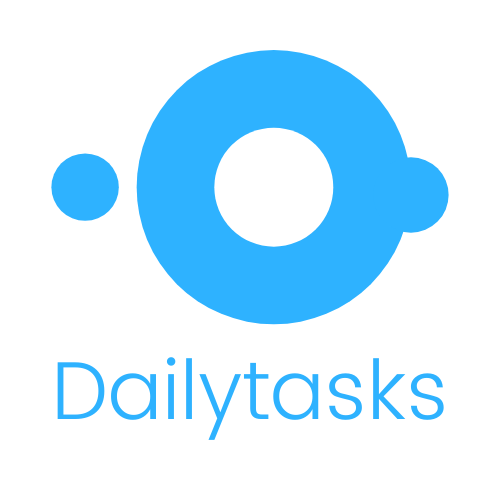

<p align="center">
  <a href="https://github.com/costajvsc/dailytasks">
    
  </a>

  <h3 align="center">Dailytasks</h3>

  <p align="center">
    Manager your tasks and do every you want.
    <br />
    <a href="#">View Demo</a>
    ·
    <a href="https://github.com/costajvsc/dailytasks/issues">Report Bug</a>
    ·
    <a href="https://github.com/costajvsc/dailytasks/issues">Request Feature</a>
  </p>
</p>

<details open="open">
  <summary>Table of Contents</summary>
  <ol>
    <li>
      <a href="#about-the-project">About The Project</a>
      <ul>
        <li><a href="#built-with">Built With</a></li>
      </ul>
    </li>
    <li>
      <a href="#getting-started">Getting Started</a>
      <ul>
        <li><a href="#prerequisites">Prerequisites</a></li>
        <li><a href="#installation">Installation</a></li>
      </ul>
    </li>
    <li><a href="#references">References</a></li>
    <li><a href="#contributing">Contributing</a></li>
    <li><a href="#license">License</a></li>
    <li><a href="#contact">Contact</a></li>
    <li><a href="#knowledge">Knowledge</a></li>
  </ol>
</details>

## About The Project

Dailytasks is a simple project to manager our tasks and do everything in our days. The scope is a CRUD feature using the best practices to code web application using framework [Laravel](https://laravel.com). This is a simple personal project and i use it to manager my daily and week.

### Here's why:
* Manager your tasks that you have do in your day.
* Code a simple project using Laravel Framework.
* Understand full cycle to schedule, implement, publish and improve a web application.
* Use this to show my abilities with programming and software development.

Of course, no one template will serve all projects since your needs may be different. So I'll be adding more in the near future. You may also suggest changes by forking this repo and creating a pull request or opening an issue. Thanks to all the people have have contributed to expanding this template!

A list of commonly used resources that I find helpful are listed in the acknowledgements.

### Built With

Dailytasks was built with those frameworks and library. 
* [Laravel](https://laravel.com)
* [Bootstrap](https://getbootstrap.com)
* [JQuery](https://jquery.com)
* [Javascript](https://developer.mozilla.org/pt-BR/docs/Web/JavaScript) 

The JQuery library was used with Bootstrap dependency, while JavaScript was used to implement some features and interactions with frontend application.

## Getting Started

To get a local copy up and running follow these simple example steps. You need install `PHP 7.3`, `MySQL` and `npm` in your environment setup. 

### Prerequisites

1. Clone the repository
   ```sh
   git clone https://github.com/costajvsc/dailytasks.git
   ```

2. Install dependencies packages.

* composer
  ```
    composer install
  ```
* npm
  ```
    npm install
  ```

### Installation

1. Create `.env` configuration. You can copy and modify the `.env.example` to complete these step.

2. Running migrations and seeders
   ```shell
   php artisan migrate
   php artisan db:seed
   ```
3. Server your application
   ```
   php artisan serve
   ```

## References

### UI References
- [Dashboard for Task Management](https://dribbble.com/shots/6816310--Exploration-Dashboard-for-Task-Management/attachments/6816310--Exploration-Dashboard-for-Task-Management?mode=media)
- [Task Tracker - Dark Theme](https://dribbble.com/shots/4949208-Task-Tracker-Dark-Theme/attachments/4949208?mode=media)
- [Coder Dashboard - Info Reveal](https://dribbble.com/shots/4586949/attachments/4586949-Coder-Dashboard-Info-Reveal?mode=media)
- [Tp Concept](https://dribbble.com/shots/6903052/attachments/6903052-Tp-Concept?mode=media)

## Contributing

Contributions are what make the open source community such an amazing place to be learn, inspire, and create. Any contributions you make are **greatly appreciated**.

1. Fork the Project
2. Create your Feature Branch (`git checkout -b feature/AmazingFeature`)
3. Commit your Changes (`git commit -m 'Add some AmazingFeature'`)
4. Push to the Branch (`git push origin feature/AmazingFeature`)
5. Open a Pull Request

## Contact

João Victor - [LinkedIn](https://www.linkedin.com/in/victor-costa-jvsc/) - costa.jvsc@gmail.com

Project Link: [https://github.com/costajvsc/dailytasks](https://github.com/costajvsc/dailytasks)

## Knowledge
* MVC Architecture 
* Migrations and Seeds
* Full cycle development
